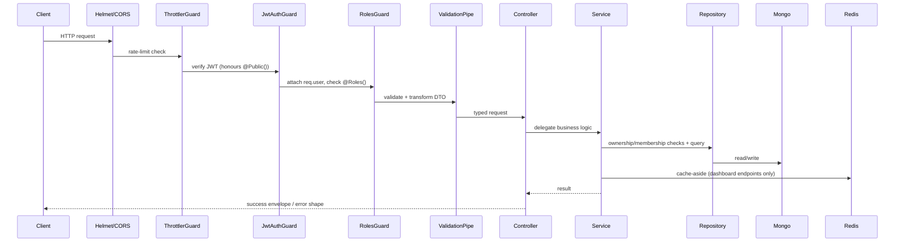
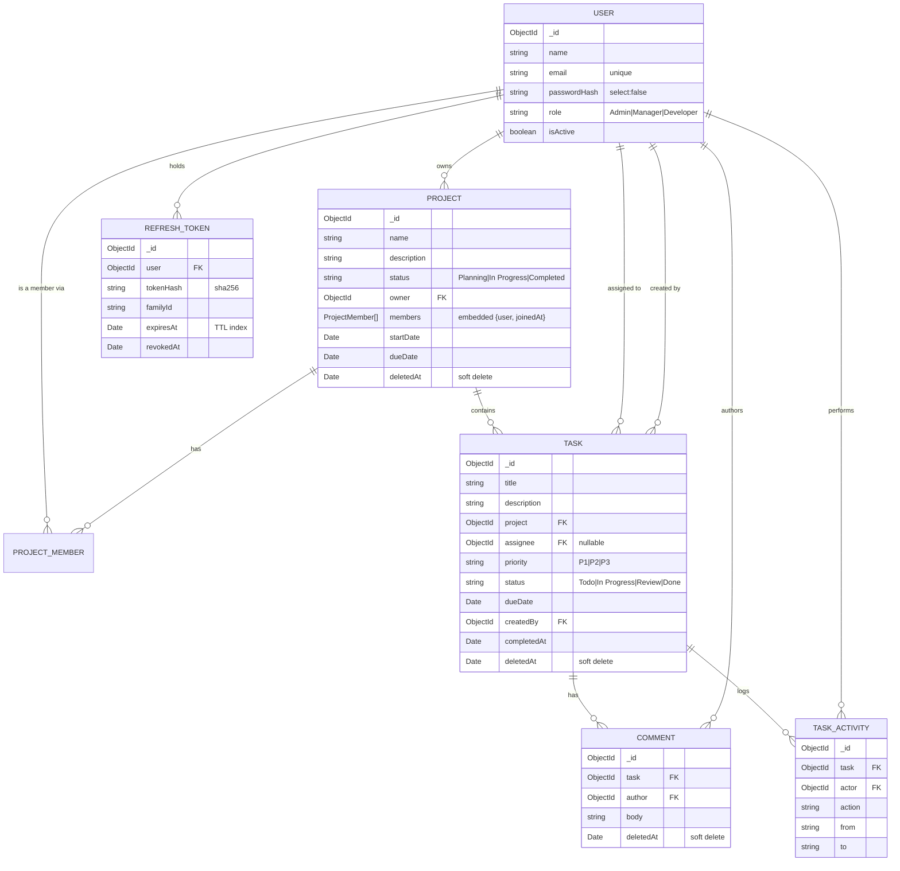

# Project & Task Management API

A production-shaped REST API for a Jira/Trello-style Project & Task Management System, built with NestJS 10, MongoDB/Mongoose and Redis.

> **Status:** Auth, Users, Projects, Tasks, Comments and the Dashboard are all implemented and wired to
> the frontend. Test coverage, Postman collection, and CI/Docker are still at their Phase 1 baseline —
> see §16–17.

## 1. Overview & Feature List

- JWT auth with rotating refresh tokens and reuse detection
- Role-based access control for Admin / Manager / Developer, enforced by guards + service-level ownership checks
- Projects with lifecycle transitions and membership management (add/remove with reassignment)
- Tasks with a Todo → In Progress → Review → Done workflow, activity trail and comments
- Role-scoped dashboard driven entirely by MongoDB aggregation pipelines, cached in Redis
- Structured logging, centralized error handling, pagination, Docker, CI

## 2. Tech Stack

| Layer | Technology | Why |
|---|---|---|
| Runtime | Node.js 20 LTS | Stable LTS with native fetch/test runner, wide ecosystem support |
| Language | TypeScript (strict) | Compile-time safety across a large, multi-module domain |
| Framework | NestJS 10 | Guards/decorators/DI map directly onto the role-based authorization requirement |
| Database | MongoDB + Mongoose | Document model fits Project→Task→Comment nesting; Mongoose gives schema-level validation |
| Caching | Redis (`ioredis`) | Cache-aside for aggregation-heavy dashboard endpoints |
| Auth | `@nestjs/jwt` + `@nestjs/passport` | Standard, well-audited JWT strategy integration with Nest guards |
| Password hashing | `bcrypt` | Industry-standard adaptive hashing |
| Validation | `class-validator` / `class-transformer` | Declarative DTO validation wired into Nest's global pipe |
| API docs | `@nestjs/swagger` | Generates OpenAPI 3 + interactive `/api/docs` from the same decorators |
| Logging | Pino via `nestjs-pino` | Low-overhead structured JSON logging with request-id propagation |
| Testing | Jest + Supertest + `mongodb-memory-server` | Real HTTP integration tests without a live Mongo instance |
| Env config | `@nestjs/config` + Joi | Fail-fast boot if required env vars are missing/malformed |
| Container | Docker + Docker Compose | One-command local stack (api + mongo + redis) |
| CI | GitHub Actions | Lint/build/test gate on every push/PR |

**Repo split:** backend and frontend are two separate repositories. This repo is backend only; see [§19](#19-frontend-repo).

## 3. Architecture Overview

Every request flows through the same pipeline:



Cross-cutting concerns (`AllExceptionsFilter`, `TransformInterceptor`, `LoggingInterceptor`, global `ValidationPipe`) are registered once in `AppModule` / `main.ts` and apply to every route unless explicitly opted out (see `@RawResponse()` on `/health`).

## 4. Prerequisites

- Node.js ≥ 20 and npm
- Docker + Docker Compose (recommended path)
- MongoDB 7 and Redis 7 if running without Docker

## 5. Local Setup

### With Docker (one command)

```bash
cp .env.example .env
docker compose up --build
```

This brings up `mongo`, `redis` and `api` with health-checked startup ordering. API listens on `http://localhost:3000/api/v1`, Swagger at `http://localhost:3000/api/docs`.

For live-reload development, layer the dev override:

```bash
docker compose -f docker-compose.yml -f docker-compose.dev.yml up --build
```

**Running alongside the frontend repo:** the frontend has its own compose file. To let both stacks reach each other by service name, create a shared external network once (`docker network create bench-shared-network`), then add `networks: { default: { name: bench-shared-network, external: true } }` to both compose files instead of the default project-local network.

### Without Docker

```bash
cp .env.example .env   # point MONGO_URI / REDIS_HOST at local instances
npm install
npm run start:dev
```

## 6. Environment Variables

| Name | Required | Default | Description |
|---|---|---|---|
| `NODE_ENV` | no | `development` | `development` \| `test` \| `production` |
| `PORT` | no | `3000` | HTTP port |
| `API_PREFIX` | no | `api/v1` | Global route prefix |
| `MONGO_URI` | yes | — | Mongo connection string |
| `MONGO_DB_NAME` | yes | — | Database name |
| `REDIS_HOST` | yes | — | Redis host |
| `REDIS_PORT` | yes | — | Redis port |
| `REDIS_PASSWORD` | no | — | Redis password, if any |
| `REDIS_TTL_DASHBOARD` | no | `60` | Cache TTL (s) for most dashboard endpoints |
| `REDIS_TTL_TREND` | no | `300` | Cache TTL (s) for `/dashboard/task-trend` |
| `JWT_ACCESS_SECRET` | yes | — | Access token signing secret |
| `JWT_ACCESS_EXPIRES_IN` | no | `15m` | Access token lifetime |
| `JWT_REFRESH_SECRET` | yes | — | Refresh token signing secret |
| `JWT_REFRESH_EXPIRES_IN` | no | `7d` | Refresh token lifetime |
| `BCRYPT_SALT_ROUNDS` | no | `12` | bcrypt cost factor |
| `LOG_LEVEL` | no | `info` | Pino log level |
| `THROTTLE_TTL` / `THROTTLE_LIMIT` | no | `60` / `100` | Global rate limit window (s) / requests |
| `AUTH_THROTTLE_LIMIT` | no | `5` | Stricter limit on `/auth/login`, `/auth/register` |
| `SWAGGER_ENABLED` | no | `true` | Toggle Swagger UI + `openapi.json` export |
| `SEED_ADMIN_EMAIL` / `SEED_ADMIN_PASSWORD` | yes | — | Seed script's Admin credentials |

The app **refuses to boot** if a required variable is missing or malformed — enforced by the Joi schema in `src/config/env.validation.ts`.

## 7. Seed Data & Demo Credentials

```bash
npm run seed
```

`src/seed/seed.ts` is idempotent (safe to re-run — it skips anything that already exists by email/name)
and creates one account per role plus a small demo dataset:

| Role | Email | Password |
|---|---|---|
| Admin | value of `SEED_ADMIN_EMAIL` (`.env`) | value of `SEED_ADMIN_PASSWORD` (`.env`) |
| Manager | `manager@example.com` | `Manager@12345` |
| Developer | `developer@example.com` | `Developer@12345` |

It also creates **"Demo Project"** (owned by the seeded Manager, with the seeded Developer as a member)
with two sample tasks assigned to the Developer, so the dashboard and project screens have real
numbers to show immediately after a fresh `docker compose up` / `npm run start:dev`.

Note: an Admin/Manager account can only come from this seed script or from an existing Admin creating
one via `POST /users` — `POST /auth/register` always creates a Developer (see §11).

## 8. API Summary

Full interactive docs live at `/api/docs` (Swagger UI, bearer-auth enabled — paste a token and execute requests in-browser). OpenAPI JSON is exported to `openapi.json` on boot when `SWAGGER_ENABLED=true` outside production.

All paths below are relative to `/api/v1`. "Own" in the Access column means the caller is the resource's owner or, for tasks, the assignee.

### Health

| Method | Path | Access | Notes |
|---|---|---|---|
| GET | `/health` | Public | `{ status, uptime, timestamp, mongo, redis, version }`. Used by the Docker healthcheck. |

### Auth

| Method | Path | Access | Notes |
|---|---|---|---|
| POST | `/auth/register` | Public | Always creates a Developer, regardless of any `role` sent. Rate-limited (5/min/IP). Returns `{ accessToken, refreshToken, user }`. |
| POST | `/auth/login` | Public | Rate-limited (5/min/IP). Blocks deactivated users. Generic 401 message on failure. |
| POST | `/auth/refresh` | Public + valid refresh token | Rotating — the presented token is revoked and a new pair issued. Reusing an already-rotated token revokes the whole token family and returns 401. |
| POST | `/auth/logout` | Authenticated | Revokes the caller's refresh tokens (see §11 for why this is "all", not just one). |
| POST | `/auth/logout-all` | Authenticated | Same as `/auth/logout` today; kept as an explicit, separately-documented endpoint. |
| GET | `/auth/me` | Authenticated | Current user profile from the token. |
| PATCH | `/auth/me/password` | Authenticated | `{ currentPassword, newPassword }`; revokes all refresh tokens on success. |

### Users (Admin only unless noted)

| Method | Path | Access | Notes |
|---|---|---|---|
| GET | `/users` | Admin | Paginated; `search`, `role`, `isActive`, sort by name/email/createdAt/role. |
| GET | `/users/assignable` | Admin, Manager | Active Developers only, for assignee pickers. |
| GET | `/users/:id` | Admin | |
| POST | `/users` | Admin | Create a user with an explicit role. 409 on duplicate email. |
| PATCH | `/users/:id` | Admin | Update name/email. |
| PATCH | `/users/:id/role` | Admin | Body `{ role }`. 409 if targeting self. |
| PATCH | `/users/:id/status` | Admin | Body `{ isActive }`. 409 if deactivating self. Existing tokens for that user stop working immediately (see §11). |
| GET | `/users/:id/workload` | Admin, Manager | Task counts by status + completion rate for one user. |

### Projects

| Method | Path | Access | Notes |
|---|---|---|---|
| POST | `/projects` | Admin, Manager | Manager becomes owner automatically; Admin may pass `owner`. |
| GET | `/projects` | All (auto-scoped) | Paginated; `search`, `status`, `owner`, `member`, sort by name/status/dueDate/createdAt. |
| GET | `/projects/:id` | All (scoped) | 403 if not Admin/owner/member. Includes populated owner + members and `taskCount`. |
| PATCH | `/projects/:id` | Admin, Manager (own) | name/description/dueDate. |
| PATCH | `/projects/:id/status` | Admin, Manager (own) | Transition-validated (409 otherwise); blocks `Completed` while non-`Done` tasks remain. |
| DELETE | `/projects/:id` | Admin, Manager (own) | Soft delete, cascades to the project's tasks and their comments. 204. |
| GET | `/projects/:id/members` | All (scoped) | |
| POST | `/projects/:id/members` | Admin, Manager (own) | Body `{ userIds }`; must be active Developers; idempotent. |
| DELETE | `/projects/:id/members/:userId` | Admin, Manager (own) | Optional `?reassignTo=`; 409 if the member has open tasks and no `reassignTo` given. |
| GET | `/projects/:id/tasks` | All (scoped) | Same filters as `/tasks`, pre-scoped to the project. |
| GET | `/projects/:id/stats` | All (scoped) | Per-project task aggregation for the detail page. |

### Tasks

| Method | Path | Access | Notes |
|---|---|---|---|
| POST | `/tasks` | Admin, Manager (own project) | 409 if the project is `Completed`. Writes a `created` activity row. |
| GET | `/tasks` | All (auto-scoped) | Filters: `project`, `assignee`, `status`, `priority`, `dueDateFrom/To`, `overdue`, `search`, `createdBy`. |
| GET | `/tasks/overdue` | All (scoped) | Paginated overdue list. |
| GET | `/tasks/my-tasks` | All | Tasks assigned to the caller. |
| GET | `/tasks/:id` | All (scoped) | Populated project/assignee/createdBy. |
| PATCH | `/tasks/:id` | Admin, Manager (own project) | title/description/priority/dueDate; activity row per changed field. |
| PATCH | `/tasks/:id/status` | Admin, Manager (own), **or** Developer on their own assigned task | Transition-validated (409 otherwise). |
| PATCH | `/tasks/:id/assignee` | Admin, Manager (own project) | Assignee must be the project owner or a member (400 otherwise). |
| DELETE | `/tasks/:id` | Admin, Manager (own project) | Soft delete. 204. |
| GET | `/tasks/:id/activity` | All (scoped) | Paginated audit trail. |

### Comments

| Method | Path | Access | Notes |
|---|---|---|---|
| POST | `/tasks/:taskId/comments` | Any project member (incl. owner) | 403 for non-members. |
| GET | `/tasks/:taskId/comments` | Any project member | Paginated, newest first by default. |
| PATCH | `/comments/:id` | Author only (Admin may edit any) | |
| DELETE | `/comments/:id` | Author or Admin | Soft delete. 204. |

### Dashboard (all cached, role-scoped — see §12)

| Method | Path | Returns |
|---|---|---|
| GET | `/dashboard/summary` | Top stat cards: totals, projects by status, open/completed tasks, overdue count, completion rate. |
| GET | `/dashboard/projects-by-status` | `[{ status, count }]`, zero-filled. |
| GET | `/dashboard/tasks-status` | `[{ status, count }]` for all four task statuses, zero-filled. |
| GET | `/dashboard/tasks-by-priority` | `[{ priority, count }]` for P1/P2/P3, zero-filled. |
| GET | `/dashboard/developer-workload` | `[{ userId, name, totalAssigned, completed, completionRate }]`, sortable via `?sortBy=workload\|completionRate\|name`. |
| GET | `/dashboard/overdue-summary` | Up to 100 overdue tasks with project/assignee. |
| GET | `/dashboard/task-trend?days=30` | `[{ date, created, completed }]` per day. |

All seven accept an optional `?projectId=` to narrow scope (with an access check).

## 9. Data Model



### Indexes

| Collection | Index | Purpose |
|---|---|---|
| `users` | `{ email: 1 }` unique | Login lookup, duplicate prevention |
| `users` | `{ role: 1 }`, `{ isActive: 1 }` | Admin list filters |
| `projects` | `{ owner: 1 }`, `{ status: 1 }`, `{ 'members.user': 1 }`, `{ deletedAt: 1 }` | Role-scoping and list filters |
| `projects` | `{ name: 'text' }` | Search |
| `tasks` | `{ project: 1 }`, `{ assignee: 1 }`, `{ status: 1 }`, `{ dueDate: 1 }` | Required per the brief |
| `tasks` | `{ project: 1, status: 1 }`, `{ assignee: 1, status: 1 }` | Compound — board/list filtering |
| `tasks` | `{ title: 'text', description: 'text' }` | Search |
| `comments` | `{ task: 1, createdAt: -1 }` | Paginated, ordered thread per task |
| `task_activities` | `{ task: 1, createdAt: -1 }` | Paginated audit trail per task |
| `refresh_tokens` | `{ expiresAt: 1 }` TTL (`expireAfterSeconds: 0`) | Mongo auto-deletes expired tokens |
| `refresh_tokens` | `{ familyId: 1 }`, `{ user: 1 }`, `{ tokenHash: 1 }` | Family revocation, per-user revocation, refresh lookup |

`Project.members` is embedded (small, bounded array, always read with the project) rather than a
separate collection — the opposite trade-off to Comments (§14), made because membership is small
and always needed alongside the project.

## 10. Role & Permission Matrix

| Capability | Admin | Manager | Developer |
|---|---|---|---|
| Register / login | ✓ | ✓ | ✓ |
| List/view all users | ✓ | ✗ | ✗ |
| Create user, change role, activate/deactivate | ✓ | ✗ | ✗ |
| List assignable developers | ✓ | ✓ | ✗ |
| Create project | ✓ | ✓ | ✗ |
| Update/delete project | ✓ any | ✓ own only | ✗ |
| Add/remove project members | ✓ any | ✓ own only | ✗ |
| View project | ✓ all | ✓ owned + member of | ✓ member of only |
| Create task | ✓ any project | ✓ own projects | ✗ |
| Update task title/description/priority/dueDate/assignee | ✓ | ✓ own projects | ✗ |
| Change task status | ✓ | ✓ own projects | ✓ own assigned tasks only |
| Delete task | ✓ | ✓ own projects | ✗ |
| Comment on task | ✓ | ✓ | ✓ if project member |
| Edit/delete own comment | ✓ any | ✓ own | ✓ own |
| Dashboard | org-wide | scoped to owned/member projects | scoped to own assigned tasks |

Enforced in two layers, always: `@Roles(...)` + `RolesGuard` for coarse role gating (`src/common/guards/roles.guard.ts`),
plus an ownership/membership check inside the relevant service (`ProjectsService.assertUserCanManage`,
`TasksService`'s per-action checks) for the "own only" / "member of" cells above. A curl/Postman call
that skips the UI still gets the same 403 — role gating never lives only in the frontend
(see `Bench-FE`'s `lib/permissions.ts` comment: *"Never trust this alone; the API is the real gate"*).

## 11. Auth & Token Invalidation Strategy

**Access token:** short-lived (15m, `JWT_ACCESS_EXPIRES_IN`), stateless, signed HS256 with `JWT_ACCESS_SECRET`.
Payload is `{ sub: userId, email, role, iat, exp }` (`src/common/interfaces/jwt-payload.interface.ts`).
Verified on every request by `JwtStrategy` (`src/modules/auth/strategies/jwt.strategy.ts`), which also
re-reads the user from the database and rejects with 401 if `isActive` is now `false` — so deactivating
a user invalidates their *already-issued, unexpired* access tokens immediately, not just future logins.
This is the one place the access token isn't purely stateless; it's a deliberate one-query cost per
request in exchange for that guarantee.

**Refresh token:** a long-lived (7d, `JWT_REFRESH_EXPIRES_IN`), high-entropy random value — not a JWT.
Only its SHA-256 hash is persisted (`RefreshToken.tokenHash`, `src/modules/auth/schemas/refresh-token.schema.ts`),
alongside a `familyId` and a TTL-indexed `expiresAt` so Mongo garbage-collects expired rows on its own.

**Rotation + reuse detection:** every `POST /auth/refresh` call revokes the presented token and issues a
new one in the same `familyId` (`AuthService.refresh`). If a token that's already been revoked is
presented again — the classic signal of a stolen/replayed refresh token — the **entire family** is
revoked and the request is rejected with 401, killing every session descended from that login, not just
the one being replayed.

**Why rotation over a blacklist:** a full access-token blacklist would need a Redis (or DB) lookup on
*every* authenticated request. Rotation keeps the access token fully stateless-and-fast while still
giving the refresh path revocability, at the cost of the `isActive` check above being the only
per-request lookup.

**Logout:** `POST /auth/logout` revokes **every** refresh token for the calling user, not only the one
the client happens to be holding. This is a deliberate adaptation to the frontend's actual contract —
`Bench-FE`'s `authService.logout()` calls this endpoint with no body, so the backend has no specific
refresh token to target. Revoking all of them is a safe superset (equivalent in effect to
`/auth/logout-all`) and matches what a user expects "log out" to do. **Residual access window:** because
the access token itself isn't blacklisted, a logged-out session's access token still works for up to its
remaining 15-minute lifetime unless the account is also deactivated — the frontend mitigates this by
discarding the token from memory immediately on logout.

**Password change:** `PATCH /auth/me/password` revokes all of the user's refresh tokens on success, so
changing your password signs out every other session (documented to the user in the Profile screen).

## 12. Caching Strategy

Implemented in `src/redis/cache.service.ts`, wired for dashboard endpoints starting Phase 5:

- Cache-aside, **only** on `/dashboard/*` aggregation endpoints.
- Key format: `dash:v1:{endpoint}:{role}:{userId}:{hash(queryParams)}` (see `src/common/utils/cache-key.util.ts`).
- TTL: `REDIS_TTL_DASHBOARD` (60s default) for most endpoints, `REDIS_TTL_TREND` (300s default) for `task-trend`.
- Invalidation: pattern delete on `dash:v1:*` via Redis `SCAN` (never `KEYS`) on every write that changes a dashboard number.
- **Graceful degradation:** every cache call is wrapped in try/catch; a Redis outage logs a warning and falls through to Mongo. The app stays fully functional with Redis down (unit-tested).

## 13. Soft-Delete / Cascade Decision

**Chosen approach: soft delete with cascade marking.** Deleting a project sets `deletedAt` on the project and cascades to its tasks and their comments; nothing is physically removed. All reads filter `deletedAt: null` via a repository-level helper, never built ad hoc in controllers.

**Rationale:** preserves audit trail and historical dashboard numbers, makes accidental deletion recoverable, avoids orphaned tasks.
**Trade-off:** every query must remember the filter — mitigated by centralizing it in the repository layer.

## 14. Embedded vs. Separate Comments Decision

**Chosen approach: comments are a separate collection**, not embedded in `Task`. Comment lists are paginated independently, are unbounded in growth (risking the 16MB document cap), and need their own author population and permission checks. Embedding would only be preferable if comments were few, always fetched with the parent task, and never queried alone.

## 15. Status Transition Diagrams

_Added in Phase 3 (projects) and Phase 4 (tasks) alongside `project-status.rules.ts` / `task-status.rules.ts`._

## 16. Testing

```bash
npm test              # full suite: unit + integration
npm run test:unit
npm run test:integration
npm run test:cov       # with coverage, threshold enforced at 80%
npm run test:watch
```

Phase 1 ships the harness (`jest.config.ts`, `test/setup/mongo-memory.setup.ts`) with an empty suite so CI is green from the first commit; coverage is filled in phase by phase and the CI coverage step is enforced (no longer `continue-on-error`) once Phase 6 lands.

## 17. Docker & CI/CD

- `Dockerfile`: multi-stage (`deps` → `builder` → `runner`), non-root `node` user, `dumb-init`, `HEALTHCHECK` against `/api/v1/health`.
- `docker-compose.yml`: `api` + `mongo` + `redis`, health-checked startup ordering, named volumes.
- `docker-compose.dev.yml`: bind-mounts the repo into the `deps` stage and runs `start:dev` for live reload.
- `.github/workflows/ci.yml`: checkout → setup-node → `npm ci` → lint → format:check → build → test:unit → test:integration → (coverage artifact, non-blocking until Phase 6) on every push/PR to `main`/`develop`.
- Husky `pre-commit` (lint-staged) and `commit-msg` (commitlint) hooks enforce quality and conventional commits locally.

## 18. Assumptions & Trade-offs

- **Node 20 target, developed on Node 24 locally** — `engines.node >= 20` in `package.json`; no Node-20-only APIs used.
- **Dependency versions** — exact `^` ranges were chosen to satisfy "NestJS 10 / current majors" since the brief doesn't pin versions; see `package.json`.
- **Local git only for now** — no remote configured; push destinations are the user's call.
- **`openapi.json` regenerated on every non-production boot** (when Swagger is enabled) rather than only via a manual export script, so it never drifts from the live decorators; still committed as a deliverable.
- **`/health` bypasses the global success envelope** via a `@RawResponse()` decorator so its body shape matches the brief exactly (`{ status, uptime, ... }`), since Docker's healthcheck and CI smoke tests read it directly.
- **CI coverage step is `continue-on-error` through Phase 5** — the brief's own build order fills coverage incrementally per module; gating on 80% before any tests exist would make every early-phase CI run red for no useful reason. It becomes a hard gate in Phase 6 per the acceptance criteria in §14 of the brief.
- **Docker Compose network is project-local by default**, not `external`, so `docker compose up` works standalone with zero prerequisites; joining it with the frontend's compose file via a shared external network is documented as an opt-in step (§5).
- **CORS is hardcoded wide-open (`origin: '*'`) in `main.ts`, not env-driven.** By explicit request, `CORS_ORIGIN` was removed from config/env validation entirely rather than kept as an unused variable. Safe here because auth is a Bearer token in the `Authorization` header (no cookies, so `credentials: true` was dropped too — it's invalid alongside a wildcard origin anyway). If the API later needs cookie-based auth or origin restriction, reintroduce a proper allowlist instead of a wildcard.

## 19. Frontend Repo

Frontend lives in a separate repository (see the sibling `Bench-FE` / `FRONTEND_MASTER_PROMPT.md`). This repo is backend-only.

## 20. Project Structure

```
project-task-management-api/
├── .github/workflows/ci.yml
├── docker/
├── src/
│   ├── main.ts, app.module.ts
│   ├── common/            # decorators, guards, filters, interceptors, pipes, dto, enums, utils
│   ├── config/             # configuration.ts, env.validation.ts
│   ├── database/           # Mongoose connection module
│   ├── redis/              # Redis client + CacheService
│   ├── modules/
│   │   ├── health/          ✅ Phase 1
│   │   ├── auth/            Phase 2
│   │   ├── users/           Phase 2
│   │   ├── projects/        Phase 3
│   │   ├── tasks/           Phase 4
│   │   ├── comments/        Phase 4
│   │   └── dashboard/       Phase 5
│   └── seed/                Phase 2
├── test/{unit,integration,setup}/
├── postman/
├── Dockerfile, docker-compose.yml, docker-compose.dev.yml
└── README.md
```
