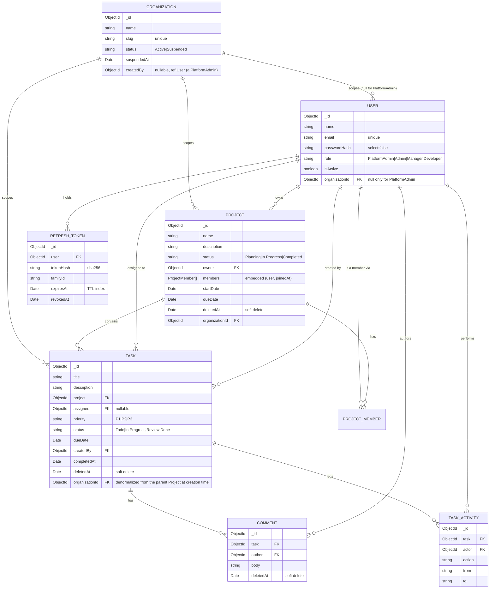

# Project & Task Management API

A production-shaped REST API for a Jira/Trello-style Project & Task Management System, built with NestJS 10, MongoDB/Mongoose and Redis.

> **Status:** Auth, Users, Projects, Tasks, Comments, the Dashboard, multi-tenancy (Organizations +
> PlatformAdmin), unit/integration tests, Postman collection, Docker, and CI are all implemented and
> wired to the frontend. **Demo:** see [`DEMO_SCRIPT.md`](./DEMO_SCRIPT.md) for a ready-to-record
> walkthrough script (auth, role differences, task flow, dashboard, Platform Admin) — no recording
> has been made yet; this is the checklist for producing one.

## 1. Overview & Feature List

- Multi-tenant: every Organization's data (users, projects, tasks, comments) is fully isolated from
  every other Organization's, enforced at the API layer — see §9–10
- A separate **PlatformAdmin** role manages Organizations themselves (create/suspend/rename, add org
  admins) and is hard-blocked from ever seeing any organization's project/task/comment data
- JWT auth with rotating refresh tokens and reuse detection; org suspension invalidates active sessions immediately
- Role-based access control for PlatformAdmin / Admin / Manager / Developer, enforced by guards + service-level ownership checks
- Projects with lifecycle transitions and membership management (add/remove with reassignment)
- Tasks with a Todo → In Progress → Review → Done workflow, activity trail and comments
- Role-scoped dashboard driven entirely by MongoDB aggregation pipelines, cached in Redis
- Structured logging, centralized error handling, pagination, Docker, CI, unit + integration test suite

## 2. Tech Stack

| Layer | Technology | Why |
|---|---|---|
| Runtime | Node.js 20 LTS | Stable LTS with native fetch/test runner, wide ecosystem support |
| Language | TypeScript (strict) | Compile-time safety across a large, multi-module domain |
| Framework | NestJS 10 | Guards/decorators/DI map directly onto the role-based authorization requirement |
| Database | MongoDB + Mongoose | Document model fits Project→Task→Comment nesting; Mongoose gives schema-level validation |
| Caching | Redis (`ioredis`) | Cache-aside for aggregation-heavy dashboard endpoints |
| Auth | `@nestjs/jwt` + `@nestjs/passport` | Standard, well-audited JWT strategy integration with Nest guards |
| Password hashing | `bcrypt` | Industry-standard adaptive hashing |
| Validation | `class-validator` / `class-transformer` | Declarative DTO validation wired into Nest's global pipe |
| API docs | `@nestjs/swagger` | Generates OpenAPI 3 + interactive `/api/docs` from the same decorators |
| Logging | Pino via `nestjs-pino` | Low-overhead structured JSON logging with request-id propagation |
| Testing | Jest + Supertest + `mongodb-memory-server` | Real HTTP integration tests without a live Mongo instance |
| Env config | `@nestjs/config` + Joi | Fail-fast boot if required env vars are missing/malformed |
| Container | Docker + Docker Compose | One-command local stack (api + mongo + redis) |
| CI | GitHub Actions | Lint/build/test gate on every push/PR |

**Repo split:** backend and frontend are two separate repositories. This repo is backend only; see [§19](#19-frontend-repo).

## 3. Architecture Overview

Every request flows through the same pipeline:

```mermaid
sequenceDiagram
    participant Client
    participant Helmet/CORS
    participant Throttler as ThrottlerGuard
    participant JwtGuard as JwtAuthGuard
    participant OrgGuard as OrganizationScopeGuard
    participant RolesGuard
    participant Pipe as ValidationPipe
    participant Controller
    participant Service
    participant Repository
    participant Mongo
    participant Redis

    Client->>Helmet/CORS: HTTP request
    Helmet/CORS->>Throttler: rate-limit check
    Throttler->>JwtGuard: verify JWT (honours @Public()); also re-checks org isn't suspended
    JwtGuard->>OrgGuard: attach req.user (incl. organizationId)
    OrgGuard->>RolesGuard: enforce platform/org split (@PlatformOnly() vs everything else)
    RolesGuard->>Pipe: check @Roles(), then validate + transform DTO
    Pipe->>Controller: typed request
    Controller->>Service: delegate business logic
    Service->>Repository: ownership/membership checks + query
    Repository->>Mongo: read/write
    Service->>Redis: cache-aside (dashboard endpoints only)
    Service-->>Controller: result
    Controller-->>Client: success envelope / error shape
```

Cross-cutting concerns (`AllExceptionsFilter`, `TransformInterceptor`, `LoggingInterceptor`, global `ValidationPipe`) are registered once in `AppModule` / `main.ts` and apply to every route unless explicitly opted out (see `@RawResponse()` on `/health`).

**`OrganizationScopeGuard`** (`src/common/guards/organization-scope.guard.ts`) is the multi-tenancy
enforcement point: it's a fail-closed allowlist, not a blocklist. A route marked `@PlatformOnly()` is
reachable *only* by a PlatformAdmin; every other non-public, non-`@SharedRoute()` route is reachable by
everyone *except* a PlatformAdmin. This means a new org route that forgets to think about tenancy is
still automatically blocked for platform admins by default, and a new platform route is unreachable by
anyone until explicitly marked `@PlatformOnly()`. `RolesGuard` (unchanged) runs after it and still
separately enforces the fine-grained Admin/Manager/Developer split within whichever side got through.

## 4. Prerequisites

- Node.js ≥ 20 and npm
- Docker + Docker Compose (recommended path)
- MongoDB 7 and Redis 7 if running without Docker

## 5. Local Setup

### With Docker (one command)

```bash
cp .env.example .env
docker compose up --build
```

This brings up `mongo`, `redis` and `api` with health-checked startup ordering. API listens on `http://localhost:3000/api/v1`, Swagger at `http://localhost:3000/api/docs`.

For live-reload development, layer the dev override:

```bash
docker compose -f docker-compose.yml -f docker-compose.dev.yml up --build
```

**Running alongside the frontend repo:** the frontend has its own compose file. To let both stacks reach each other by service name, create a shared external network once (`docker network create bench-shared-network`), then add `networks: { default: { name: bench-shared-network, external: true } }` to both compose files instead of the default project-local network.

### Without Docker

```bash
cp .env.example .env   # point MONGO_URI / REDIS_HOST at local instances
npm install
npm run start:dev
```

## 6. Environment Variables

| Name | Required | Default | Description |
|---|---|---|---|
| `NODE_ENV` | no | `development` | `development` \| `test` \| `production` |
| `PORT` | no | `3000` | HTTP port |
| `API_PREFIX` | no | `api/v1` | Global route prefix |
| `MONGO_URI` | yes | — | Mongo connection string |
| `MONGO_DB_NAME` | yes | — | Database name |
| `REDIS_HOST` | yes | — | Redis host |
| `REDIS_PORT` | yes | — | Redis port |
| `REDIS_PASSWORD` | no | — | Redis password, if any |
| `REDIS_TTL_DASHBOARD` | no | `60` | Cache TTL (s) for most dashboard endpoints |
| `REDIS_TTL_TREND` | no | `300` | Cache TTL (s) for `/dashboard/task-trend` |
| `JWT_ACCESS_SECRET` | yes | — | Access token signing secret |
| `JWT_ACCESS_EXPIRES_IN` | no | `15m` | Access token lifetime |
| `JWT_REFRESH_SECRET` | yes | — | Refresh token signing secret |
| `JWT_REFRESH_EXPIRES_IN` | no | `7d` | Refresh token lifetime |
| `BCRYPT_SALT_ROUNDS` | no | `12` | bcrypt cost factor |
| `LOG_LEVEL` | no | `info` | Pino log level |
| `THROTTLE_TTL` / `THROTTLE_LIMIT` | no | `60` / `100` | Global rate limit window (s) / requests |
| `AUTH_THROTTLE_LIMIT` | no | `5` | Stricter limit on `/auth/login`, `/auth/register-organization` |
| `SWAGGER_ENABLED` | no | `true` | Toggle Swagger UI + `openapi.json` export |
| `SEED_ADMIN_EMAIL` / `SEED_ADMIN_PASSWORD` | yes | — | Seed script's Organisation Admin credentials |
| `PLATFORM_ADMIN_EMAIL` / `PLATFORM_ADMIN_PASSWORD` | yes | — | Seed/migration script's PlatformAdmin credentials (§7) |

The app **refuses to boot** if a required variable is missing or malformed — enforced by the Joi schema in `src/config/env.validation.ts`.

## 7. Seed Data & Demo Credentials

```bash
npm run seed
```

`src/seed/seed.ts` is idempotent (safe to re-run — it skips anything that already exists by email/name)
and creates a `"Demo Organization"`, one account per org role inside it, plus a small demo dataset,
and one platform-wide PlatformAdmin account (which belongs to no organization):

| Role | Email | Password |
|---|---|---|
| PlatformAdmin | value of `PLATFORM_ADMIN_EMAIL` (`.env`) | value of `PLATFORM_ADMIN_PASSWORD` (`.env`) |
| Admin | value of `SEED_ADMIN_EMAIL` (`.env`) | value of `SEED_ADMIN_PASSWORD` (`.env`) |
| Manager | `manager@example.com` | `Manager@12345` |
| Developer | `developer@example.com` | `Developer@12345` |

It also creates **"Demo Project"** (owned by the seeded Manager, with the seeded Developer as a member)
with two sample tasks assigned to the Developer, so the dashboard and project screens have real
numbers to show immediately after a fresh `docker compose up` / `npm run start:dev`.

Note: an Admin/Manager account within an existing org can only come from this seed script or from that
org's own Admin creating one via `POST /users` — self-registration now always creates a brand-new
**organization** (`POST /auth/register-organization`, see §11), not a bare Developer.

`src/seed/migrate-to-multi-tenant.ts` (`npm run migrate:multi-tenant`) is the one-time, safely-re-runnable
migration for retrofitting an **existing** (pre-multi-tenancy) database: it backfills every existing
user/project/task into a `"Default Organization"` and bootstraps the first PlatformAdmin from the same
two env vars. It hard-fails rather than silently repurposing an existing user if `PLATFORM_ADMIN_EMAIL`
collides with one.

## 8. API Summary

Full interactive docs live at `/api/docs` (Swagger UI, bearer-auth enabled — paste a token and execute requests in-browser). OpenAPI JSON is exported to `openapi.json` on boot when `SWAGGER_ENABLED=true` outside production.

All paths below are relative to `/api/v1`. "Own" in the Access column means the caller is the resource's owner or, for tasks, the assignee. **Every endpoint below except the `/platform/*` section is scoped to the caller's own organization** — an Admin/Manager/Developer can never see or act on another organization's data, regardless of role. The `/platform/*` section is the exact opposite: reachable only by a PlatformAdmin, and it never exposes any organization's project/task/comment data — see §10.

### Health

| Method | Path | Access | Notes |
|---|---|---|---|
| GET | `/health` | Public | `{ status, uptime, timestamp, mongo, redis, version }`. Used by the Docker healthcheck. |

### Auth

| Method | Path | Access | Notes |
|---|---|---|---|
| POST | `/auth/register-organization` | Public | Creates a brand-new Organization **and** its first Admin in one call. Rate-limited (5/min/IP). Returns `{ accessToken, refreshToken, user }`. Self-registration as a bare Developer no longer exists — every user belongs to an org, either created this way or added by that org's own Admin via `POST /users`. |
| POST | `/auth/login` | Public | Rate-limited (5/min/IP). Blocks deactivated users and users whose organization is suspended. Generic 401 message on failure either way. |
| POST | `/auth/refresh` | Public + valid refresh token | Rotating — the presented token is revoked and a new pair issued. Reusing an already-rotated token revokes the whole token family and returns 401. Also 401s if the account's organization has since been suspended. |
| POST | `/auth/logout` | Authenticated | Revokes the caller's refresh tokens (see §11 for why this is "all", not just one). |
| POST | `/auth/logout-all` | Authenticated | Same as `/auth/logout` today; kept as an explicit, separately-documented endpoint. |
| GET | `/auth/me` | Authenticated | Current user profile from the token. |
| PATCH | `/auth/me/password` | Authenticated | `{ currentPassword, newPassword }`; revokes all refresh tokens on success. |

### Users (Admin only unless noted)

| Method | Path | Access | Notes |
|---|---|---|---|
| GET | `/users` | Admin | Paginated; `search`, `role`, `isActive`, sort by name/email/createdAt/role. |
| GET | `/users/assignable` | Admin, Manager | Active Developers only, for assignee pickers. |
| GET | `/users/:id` | Admin | |
| POST | `/users` | Admin | Create a user with an explicit role. 409 on duplicate email. |
| PATCH | `/users/:id` | Admin | Update name/email. |
| PATCH | `/users/:id/role` | Admin | Body `{ role }`. 409 if targeting self. |
| PATCH | `/users/:id/status` | Admin | Body `{ isActive }`. 409 if deactivating self. Existing tokens for that user stop working immediately (see §11). |
| GET | `/users/:id/workload` | Admin, Manager | Task counts by status + completion rate for one user. |

### Projects

| Method | Path | Access | Notes |
|---|---|---|---|
| POST | `/projects` | Admin, Manager | Manager becomes owner automatically; Admin may pass `owner`. |
| GET | `/projects` | All (auto-scoped) | Paginated; `search`, `status`, `owner`, `member`, sort by name/status/dueDate/createdAt. |
| GET | `/projects/:id` | All (scoped) | 403 if not Admin/owner/member. Includes populated owner + members and `taskCount`. |
| PATCH | `/projects/:id` | Admin, Manager (own) | name/description/dueDate. |
| PATCH | `/projects/:id/status` | Admin, Manager (own) | Transition-validated (409 otherwise); blocks `Completed` while non-`Done` tasks remain. |
| DELETE | `/projects/:id` | Admin, Manager (own) | Soft delete, cascades to the project's tasks and their comments. 204. |
| GET | `/projects/:id/members` | All (scoped) | |
| POST | `/projects/:id/members` | Admin, Manager (own) | Body `{ userIds }`; must be active Developers; idempotent. |
| DELETE | `/projects/:id/members/:userId` | Admin, Manager (own) | Optional `?reassignTo=`; 409 if the member has open tasks and no `reassignTo` given. |
| GET | `/projects/:id/tasks` | All (scoped) | Same filters as `/tasks`, pre-scoped to the project. |
| GET | `/projects/:id/stats` | All (scoped) | Per-project task aggregation for the detail page. |

### Tasks

| Method | Path | Access | Notes |
|---|---|---|---|
| POST | `/tasks` | Admin, Manager (own project) | 409 if the project is `Completed`. Writes a `created` activity row. |
| GET | `/tasks` | All (auto-scoped) | Filters: `project`, `assignee`, `status`, `priority`, `dueDateFrom/To`, `overdue`, `search`, `createdBy`. |
| GET | `/tasks/overdue` | All (scoped) | Paginated overdue list. |
| GET | `/tasks/my-tasks` | All | Tasks assigned to the caller. |
| GET | `/tasks/:id` | All (scoped) | Populated project/assignee/createdBy. |
| PATCH | `/tasks/:id` | Admin, Manager (own project) | title/description/priority/dueDate; activity row per changed field. |
| PATCH | `/tasks/:id/status` | Admin, Manager (own), **or** Developer on their own assigned task | Transition-validated (409 otherwise). |
| PATCH | `/tasks/:id/assignee` | Admin, Manager (own project) | Assignee must be the project owner or a member (400 otherwise). |
| DELETE | `/tasks/:id` | Admin, Manager (own project) | Soft delete. 204. |
| GET | `/tasks/:id/activity` | All (scoped) | Paginated audit trail. |

### Comments

| Method | Path | Access | Notes |
|---|---|---|---|
| POST | `/tasks/:taskId/comments` | Any project member (incl. owner) | 403 for non-members. |
| GET | `/tasks/:taskId/comments` | Any project member | Paginated, newest first by default. |
| PATCH | `/comments/:id` | Author only (Admin may edit any) | |
| DELETE | `/comments/:id` | Author or Admin | Soft delete. 204. |

### Dashboard (all cached, role-scoped — see §12)

| Method | Path | Returns |
|---|---|---|
| GET | `/dashboard/summary` | Top stat cards: totals, projects by status, open/completed tasks, overdue count, completion rate. |
| GET | `/dashboard/projects-by-status` | `[{ status, count }]`, zero-filled. |
| GET | `/dashboard/tasks-status` | `[{ status, count }]` for all four task statuses, zero-filled. |
| GET | `/dashboard/tasks-by-priority` | `[{ priority, count }]` for P1/P2/P3, zero-filled. |
| GET | `/dashboard/developer-workload` | `[{ userId, name, totalAssigned, completed, completionRate }]`, sortable via `?sortBy=workload\|completionRate\|name`. |
| GET | `/dashboard/overdue-summary` | Up to 100 overdue tasks with project/assignee. |
| GET | `/dashboard/task-trend?days=30` | `[{ date, created, completed }]` per day. |

All seven accept an optional `?projectId=` to narrow scope (with an access check).

### Platform (PlatformAdmin only — `@PlatformOnly()`, 403 for every other role)

| Method | Path | Notes |
|---|---|---|
| POST | `/platform/organizations` | Body `{ organizationName, adminName, adminEmail, adminPassword }`. Creates the org and its first Admin in one call (no DB transaction — the target Mongo is standalone, not a replica set — so the org is deleted if creating its admin fails). |
| GET | `/platform/organizations` | Paginated `{ id, name, slug, status, userCount, createdAt, updatedAt }[]`. `search`, `status` filters. |
| GET | `/platform/organizations/:id` | Same shape + `admins: [{id,name,email,isActive}]`. Never includes project/task/comment data. |
| PATCH | `/platform/organizations/:id` | Body `{ name }` — rename only. |
| PATCH | `/platform/organizations/:id/status` | Body `{ status: 'Active' \| 'Suspended' }`. Suspending immediately blocks every member's next request and any new login (§11), not just future ones. |
| POST | `/platform/organizations/:id/admins` | Body `{ name, email, password }`. 400 if the target org is currently suspended. |
| GET | `/platform/stats` | `{ organizationCount, totalUserCount }` — the only cross-org aggregate a PlatformAdmin can see, deliberately excluding any project/task count. |

## 9. Data Model



`Comment` and `TaskActivity` deliberately do **not** carry their own `organizationId` — both are always
reached via a parent `Task`/`Project` whose org has already been checked by the caller, so denormalizing
it there would add write-path complexity with no additional protection. `Project` and `Task` do carry it
directly because they're the collections every list/aggregate query filters and scans.

### Indexes

| Collection | Index | Purpose |
|---|---|---|
| `organizations` | `{ slug: 1 }` unique | Slug lookup, duplicate prevention |
| `organizations` | `{ status: 1 }` | Platform Admin list filter |
| `users` | `{ email: 1 }` unique | Login lookup, duplicate prevention (global — see §11) |
| `users` | `{ role: 1 }`, `{ isActive: 1 }` | Admin list filters |
| `users` | `{ organizationId: 1 }` | Org-scoped user queries |
| `projects` | `{ owner: 1 }`, `{ status: 1 }`, `{ 'members.user': 1 }`, `{ deletedAt: 1 }` | Role-scoping and list filters |
| `projects` | `{ name: 'text' }` | Search |
| `projects` | `{ organizationId: 1 }`, `{ organizationId: 1, status: 1 }` | Org-scoped project queries |
| `tasks` | `{ project: 1 }`, `{ assignee: 1 }`, `{ status: 1 }`, `{ dueDate: 1 }` | Required per the brief |
| `tasks` | `{ project: 1, status: 1 }`, `{ assignee: 1, status: 1 }` | Compound — board/list filtering |
| `tasks` | `{ title: 'text', description: 'text' }` | Search |
| `tasks` | `{ organizationId: 1 }`, `{ organizationId: 1, assignee: 1 }` | Org-scoped task queries (e.g. `/tasks/my-tasks`) |
| `comments` | `{ task: 1, createdAt: -1 }` | Paginated, ordered thread per task |
| `task_activities` | `{ task: 1, createdAt: -1 }` | Paginated audit trail per task |
| `refresh_tokens` | `{ expiresAt: 1 }` TTL (`expireAfterSeconds: 0`) | Mongo auto-deletes expired tokens |
| `refresh_tokens` | `{ familyId: 1 }`, `{ user: 1 }`, `{ tokenHash: 1 }` | Family revocation, per-user revocation, refresh lookup |

`Project.members` is embedded (small, bounded array, always read with the project) rather than a
separate collection — the opposite trade-off to Comments (§14), made because membership is small
and always needed alongside the project.

## 10. Role & Permission Matrix

Two independent, non-overlapping tiers. A **PlatformAdmin** belongs to no organization and cannot reach
any of the org-scoped capabilities below (403, enforced by `OrganizationScopeGuard` — see §3); an
**Admin/Manager/Developer** belongs to exactly one organization and cannot reach any `/platform/*` route
(403, same guard, opposite direction). Every "org-wide"/"all" cell below means *within the caller's own
organization*, never across organizations.

| Capability | Admin | Manager | Developer |
|---|---|---|---|
| Log in / create own organization (self-service) | ✓ | ✓ | ✓ |
| List/view all users (in own org) | ✓ | ✗ | ✗ |
| Create user, change role, activate/deactivate (in own org) | ✓ | ✗ | ✗ |
| List assignable developers (in own org) | ✓ | ✓ | ✗ |
| Create project | ✓ | ✓ | ✗ |
| Update/delete project | ✓ any (in org) | ✓ own only | ✗ |
| Add/remove project members | ✓ any (in org) | ✓ own only | ✗ |
| View project | ✓ all (in org) | ✓ owned + member of | ✓ member of only |
| Create task | ✓ any project (in org) | ✓ own projects | ✗ |
| Update task title/description/priority/dueDate/assignee | ✓ | ✓ own projects | ✗ |
| Change task status | ✓ | ✓ own projects | ✓ own assigned tasks only |
| Delete task | ✓ | ✓ own projects | ✗ |
| Comment on task | ✓ | ✓ | ✓ if project member |
| Edit/delete own comment | ✓ any (in org) | ✓ own | ✓ own |
| Dashboard | org-wide | scoped to owned/member projects | scoped to own assigned tasks |

**PlatformAdmin** capabilities (disjoint from the table above — org management only, §8's Platform section):

| Capability | PlatformAdmin |
|---|---|
| Create / rename / suspend / reactivate an organization | ✓ |
| Add an Admin to any organization | ✓ |
| View org/user counts across the platform | ✓ |
| View any organization's projects, tasks, or comments | ✗ — never, by design |

Enforced in three layers, always: `OrganizationScopeGuard` (`src/common/guards/organization-scope.guard.ts`)
for the coarse platform-vs-org split, `@Roles(...)` + `RolesGuard` for the fine-grained role split within
whichever side that let through (`src/common/guards/roles.guard.ts`), plus an ownership/membership check
inside the relevant service (`ProjectsService.assertUserCanManage`, `TasksService`'s per-action checks,
and an implicit `organizationId` filter on every query) for the "own only" / "member of" / "in org" cells
above. A curl/Postman call that skips the UI still gets the same 403/404 — role and tenancy gating never
live only in the frontend (see `Bench-FE`'s `lib/permissions.ts` comment: *"Never trust this alone; the
API is the real gate"*).

## 11. Auth & Token Invalidation Strategy

**Access token:** short-lived (15m, `JWT_ACCESS_EXPIRES_IN`), stateless, signed HS256 with `JWT_ACCESS_SECRET`.
Payload is `{ sub: userId, email, role, organizationId, iat, exp }` (`src/common/interfaces/jwt-payload.interface.ts`;
`organizationId` is `null` only for a PlatformAdmin). Verified on every request by `JwtStrategy`
(`src/modules/auth/strategies/jwt.strategy.ts`), which also re-reads the user from the database and
rejects with 401 if `isActive` is now `false`, **or if the user's organization has since been suspended**
— so deactivating a user, or a PlatformAdmin suspending their whole organization, invalidates
*already-issued, unexpired* access tokens immediately, not just future logins. This is the one place the
access token isn't purely stateless; it's a deliberate one-query-plus-one-org-check cost per request in
exchange for that guarantee.

**Refresh token:** a long-lived (7d, `JWT_REFRESH_EXPIRES_IN`), high-entropy random value — not a JWT.
Only its SHA-256 hash is persisted (`RefreshToken.tokenHash`, `src/modules/auth/schemas/refresh-token.schema.ts`),
alongside a `familyId` and a TTL-indexed `expiresAt` so Mongo garbage-collects expired rows on its own.

**Rotation + reuse detection:** every `POST /auth/refresh` call revokes the presented token and issues a
new one in the same `familyId` (`AuthService.refresh`). If a token that's already been revoked is
presented again — the classic signal of a stolen/replayed refresh token — the **entire family** is
revoked and the request is rejected with 401, killing every session descended from that login, not just
the one being replayed.

**Why rotation over a blacklist:** a full access-token blacklist would need a Redis (or DB) lookup on
*every* authenticated request. Rotation keeps the access token fully stateless-and-fast while still
giving the refresh path revocability, at the cost of the `isActive` check above being the only
per-request lookup.

**Logout:** `POST /auth/logout` revokes **every** refresh token for the calling user, not only the one
the client happens to be holding. This is a deliberate adaptation to the frontend's actual contract —
`Bench-FE`'s `authService.logout()` calls this endpoint with no body, so the backend has no specific
refresh token to target. Revoking all of them is a safe superset (equivalent in effect to
`/auth/logout-all`) and matches what a user expects "log out" to do. **Residual access window:** because
the access token itself isn't blacklisted, a logged-out session's access token still works for up to its
remaining 15-minute lifetime unless the account is also deactivated — the frontend mitigates this by
discarding the token from memory immediately on logout.

**Password change:** `PATCH /auth/me/password` revokes all of the user's refresh tokens on success, so
changing your password signs out every other session (documented to the user in the Profile screen).

**Organization suspension:** `AuthService.login()` and `.refresh()` both call `OrganizationsService.assertActive()`
and fail with a generic 401 (not 403 — a suspended org isn't distinguishable from any other auth failure)
if the account's organization is suspended. Combined with the `JwtStrategy` check above, suspending an
organization takes effect everywhere at once: no new logins, no refreshes, and every already-issued
access token 401s on its very next request.

**Email uniqueness is global, not per-organization** — a deliberate trade-off, not an oversight. Product
decision #3 for multi-tenancy was "one org per user, no org-switcher," which means there's no login-time
org selector; keeping `User.email` globally unique (unchanged from before multi-tenancy) is what makes a
plain email+password login unambiguous. The accepted limitation: the same email address can never be
reused by two different people in two different organizations.

## 12. Caching Strategy

Implemented in `src/redis/cache.service.ts`, wired for dashboard endpoints starting Phase 5:

- Cache-aside, **only** on `/dashboard/*` aggregation endpoints.
- Key format: `dash:v1:{endpoint}:{role}:{userId}:{hash(queryParams)}` (see `src/common/utils/cache-key.util.ts`).
- TTL: `REDIS_TTL_DASHBOARD` (60s default) for most endpoints, `REDIS_TTL_TREND` (300s default) for `task-trend`.
- Invalidation: pattern delete on `dash:v1:*` via Redis `SCAN` (never `KEYS`) on every write that changes a dashboard number.
- **Graceful degradation:** every cache call is wrapped in try/catch; a Redis outage logs a warning and falls through to Mongo. The app stays fully functional with Redis down (unit-tested).

## 13. Soft-Delete / Cascade Decision

**Chosen approach: soft delete with cascade marking.** Deleting a project sets `deletedAt` on the project and cascades to its tasks and their comments; nothing is physically removed. All reads filter `deletedAt: null` via a repository-level helper, never built ad hoc in controllers.

**Rationale:** preserves audit trail and historical dashboard numbers, makes accidental deletion recoverable, avoids orphaned tasks.
**Trade-off:** every query must remember the filter — mitigated by centralizing it in the repository layer.

## 14. Embedded vs. Separate Comments Decision

**Chosen approach: comments are a separate collection**, not embedded in `Task`. Comment lists are paginated independently, are unbounded in growth (risking the 16MB document cap), and need their own author population and permission checks. Embedding would only be preferable if comments were few, always fetched with the parent task, and never queried alone.

## 15. Status Transition Diagrams

_Added in Phase 3 (projects) and Phase 4 (tasks) alongside `project-status.rules.ts` / `task-status.rules.ts`._

## 16. Testing

```bash
npm test              # full suite: unit + integration
npm run test:unit
npm run test:integration
npm run test:cov       # with coverage, threshold enforced at 80%
npm run test:watch
```

**167 tests, all passing** — 103 unit specs (`test/unit/`: guards, `AuthService`, `JwtStrategy`,
`CacheService`, status-transition rules, pagination/cache-key utils, password hashing) and 64
integration specs (`test/integration/`: full auth lifecycle, the RBAC matrix, Project/Task CRUD +
status transitions, comments, pagination/filters, dashboard caching, error-shape consistency, and a
dedicated cross-tenant isolation suite proving one organization can never read/write another's data
via any endpoint, plus the Platform Admin boundary in both directions). Integration tests boot the real
`AppModule` against `mongodb-memory-server` and a fake in-process Redis (`test/integration/setup/`), so
they exercise actual guards/services/Mongoose validation, not mocks.

## 17. Docker & CI/CD

- `Dockerfile`: multi-stage (`deps` → `builder` → `runner`), non-root `node` user, `dumb-init`, `HEALTHCHECK` against `/api/v1/health`.
- `docker-compose.yml`: `api` + `mongo` + `redis`, health-checked startup ordering, named volumes.
- `docker-compose.dev.yml`: bind-mounts the repo into the `deps` stage and runs `start:dev` for live reload.
- `.github/workflows/ci.yml`: checkout → setup-node → `npm ci` → lint → format:check → build → test:unit → test:integration → coverage artifact (currently `continue-on-error: true` — the suite is filled in and green, but the 80% threshold in `jest.config.ts` hasn't been separately confirmed as a hard CI gate yet) on every push/PR to `main`/`develop`. Requires `PLATFORM_ADMIN_EMAIL`/`PLATFORM_ADMIN_PASSWORD` alongside the other env vars in the job's `env:` block (§6).
- Husky `pre-commit` (lint-staged) and `commit-msg` (commitlint) hooks enforce quality and conventional commits locally.
- **Deploying this to a real, always-on URL (not just Docker Compose locally)?** See [`DEPLOYMENT.md`](./DEPLOYMENT.md) for a beginner-friendly, click-through guide (MongoDB Atlas + Upstash Redis + Render, all free tiers).

## 18. Assumptions & Trade-offs

- **Node 20 target, developed on Node 24 locally** — `engines.node >= 20` in `package.json`; no Node-20-only APIs used.
- **Dependency versions** — exact `^` ranges were chosen to satisfy "NestJS 10 / current majors" since the brief doesn't pin versions; see `package.json`.
- **Multi-tenancy was retrofitted, not designed in from day one** — the brief's own data model (§8) predates organizations; `Organization`/`organizationId`/`PlatformAdmin` were added afterward via `src/seed/migrate-to-multi-tenant.ts`, which safely backfills any pre-existing single-tenant data into one `"Default Organization"` rather than requiring a fresh database.
- **Postman collection** (`postman/`) — 69 requests including a dedicated "Platform Admin" folder; kept in sync with the API by hand rather than auto-exported from Swagger, so it can carry the request chaining (login → save token → reuse) and negative-test scenarios Swagger docs alone can't express.
- **`openapi.json` regenerated on every non-production boot** (when Swagger is enabled) rather than only via a manual export script, so it never drifts from the live decorators; still committed as a deliverable.
- **`/health` bypasses the global success envelope** via a `@RawResponse()` decorator so its body shape matches the brief exactly (`{ status, uptime, ... }`), since Docker's healthcheck and CI smoke tests read it directly.
- **CI coverage step is still `continue-on-error`** — the full unit + integration suite (§16) is written and green, but the 80% threshold configured in `jest.config.ts` hasn't been separately verified/enforced as a hard CI gate; flipping that off is a small follow-up, not a missing feature.
- **Docker Compose network is project-local by default**, not `external`, so `docker compose up` works standalone with zero prerequisites; joining it with the frontend's compose file via a shared external network is documented as an opt-in step (§5).
- **CORS is hardcoded wide-open (`origin: '*'`) in `main.ts`, not env-driven.** By explicit request, `CORS_ORIGIN` was removed from config/env validation entirely rather than kept as an unused variable. Safe here because auth is a Bearer token in the `Authorization` header (no cookies, so `credentials: true` was dropped too — it's invalid alongside a wildcard origin anyway). If the API later needs cookie-based auth or origin restriction, reintroduce a proper allowlist instead of a wildcard.

## 19. Frontend Repo

Frontend lives in a separate repository (see the sibling `Bench-FE` / `FRONTEND_MASTER_PROMPT.md`). This repo is backend-only.

## 20. Project Structure

```
project-task-management-api/
├── .github/workflows/ci.yml
├── docker/
├── src/
│   ├── main.ts, app.module.ts
│   ├── common/            # decorators, guards, filters, interceptors, pipes, dto, enums, utils
│   ├── config/             # configuration.ts, env.validation.ts
│   ├── database/           # Mongoose connection module
│   ├── redis/              # Redis client + CacheService
│   ├── modules/
│   │   ├── health/
│   │   ├── auth/
│   │   ├── users/
│   │   ├── organizations/   # Organization schema/service + the /platform/* controllers
│   │   ├── projects/
│   │   ├── tasks/
│   │   ├── comments/
│   │   └── dashboard/
│   └── seed/                # seed.ts (fresh DB) + migrate-to-multi-tenant.ts (retrofit existing DB)
├── test/{unit,integration,setup}/
├── postman/
├── Dockerfile, docker-compose.yml, docker-compose.dev.yml
└── README.md
```
